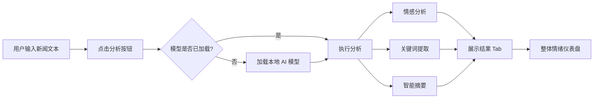

## 1. 产品概述

财经资讯智能助手是一款纯前端的财经新闻分析工具，所有 AI 推理均在浏览器本地运行，无需后端服务器，主打隐私保护和离线可用。用户可将多条财经新闻文本粘贴进来，工具帮助快速消化信息，提供情感分析、关键词提取和智能摘要功能。

- **目标用户**：投资者、财经分析师、新闻从业者等需要快速处理大量财经资讯的人群
- **核心价值**：保护数据隐私、无需联网、快速批量处理财经新闻
- **市场定位**：轻量级、隐私优先的本地财经资讯分析工具

## 2. 核心功能

### 2.1 功能模块

1. **新闻输入区**：支持粘贴多段文本、批量粘贴多条新闻、支持新闻链接输入
2. **情感分析**：对每条新闻判断利好/中性/利空，给出情感倾向得分，颜色标签标识
3. **关键词/实体提取**：高亮公司名、行业、关键经济指标，统计词频生成词云
4. **智能摘要**：将长新闻压缩成几句话的要点
5. **整体情绪概览**：批量分析时展示利好/利空占比仪表盘

### 2.2 页面详情

| 页面名称 | 模块名称 | 功能描述 |
|----------|----------|----------|
| 主页面 | 左侧输入区 | 文本输入框、批量粘贴、新闻链接输入、示例数据、分析按钮 |
| 主页面 | 右侧结果区 | Tab 切换（情感分析/关键词词云/智能摘要） |
| 主页面 | 情绪概览仪表盘 | 整体情绪占比、利好/利空/中性数量统计 |
| 主页面 | 模型加载提示 | 加载进度条、状态提示 |
| 主页面 | 分析 Loading | 推理过程中的加载动画 |

## 3. 核心流程

用户粘贴或输入财经新闻文本 → 点击分析按钮 → 模型加载（首次使用）→ 执行情感分析、关键词提取、摘要生成 → 右侧展示分析结果 → 用户可切换不同 Tab 查看 → 支持批量新闻的整体情绪概览

## 4. 用户界面设计

### 4.1 设计风格

- **主色调**：深蓝/藏青色系（#1a365d），传达专业、可信赖的金融科技感
- **辅助色**：
  - 利好：绿色（#10b981）
  - 利空：红色（#ef4444） 
  - 中性：灰色（#6b7280）
- **背景**：深色模式为主，搭配渐变和微光效果
- **字体**：现代无衬线字体，数字使用等宽字体增强金融感
- **布局**：左右分栏卡片式布局，玻璃拟态效果

### 4.2 页面设计概览

| 页面名称 | 模块名称 | UI 元素 |
|----------|----------|---------|
| 主页面 | 输入区 | 大文本框、粘贴按钮、批量导入、示例数据、分析主按钮 |
| 主页面 | 结果区 | Tab 导航、新闻卡片列表、情感标签、词云可视化、摘要文本 |
| 主页面 | 仪表盘 | 环形进度图、占比统计、情绪指数 |
| 主页面 | 加载状态 | 进度条、骨架屏、加载动画 |

### 4.3 响应式

- 桌面端（默认）：左右两栏布局，左侧 40%，右侧 60%
- 平板端：上下布局，输入区在上，结果区在下
- 移动端：单列布局，Tab 可横向滚动

### 4.4 交互动效

- 模型加载：进度条渐变动画
- 分析中：卡片骨架屏 + 脉冲效果
- Tab 切换：平滑过渡动画
- 词云：关键词悬停放大效果
- 情感标签：渐变色背景 + 微发光效果
