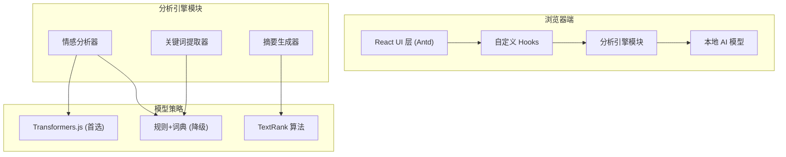

## 1. 架构设计



## 2. 技术描述

- **前端框架**：React@18 + Vite@5
- **UI 组件库**：Ant Design@5
- **样式方案**：CSS Modules + CSS Variables
- **AI 推理**：
  - 首选：@xenova/transformers（浏览器端 Transformers.js）
  - 降级：规则 + 词典方法（情感词典、财经领域关键词库）
- **词云可视化**：react-wordcloud / d3-cloud
- **图表**：@ant-design/charts（仪表盘、环形图）
- **文本摘要**：自研 TextRank 抽取式算法

## 3. 目录结构

```
src/
├── components/
│   ├── InputPanel/          # 左侧输入区
│   ├── ResultPanel/         # 右侧结果区
│   ├── SentimentTab/        # 情感分析 Tab
│   ├── KeywordCloudTab/     # 关键词词云 Tab
│   ├── SummaryTab/          # 摘要 Tab
│   ├── SentimentDashboard/  # 情绪仪表盘
│   └── ModelLoader/         # 模型加载提示
├── engine/                  # 分析引擎模块（可替换）
│   ├── index.ts             # 统一入口
│   ├── types.ts             # 类型定义
│   ├── sentiment/           # 情感分析
│   │   ├── index.ts
│   │   ├── transformer.ts   # Transformers.js 实现
│   │   └── ruleBased.ts     # 规则+词典实现
│   ├── keywords/            # 关键词提取
│   │   ├── index.ts
│   │   └── dictionary.ts    # 词典+词频统计
│   └── summary/             # 摘要生成
│       ├── index.ts
│       └── textRank.ts      # TextRank 算法
├── hooks/                   # 自定义 Hooks
│   └── useAnalysisEngine.ts # 分析引擎 Hook
├── data/                    # 数据资源
│   ├── sentimentDict.json   # 情感词典
│   └── financeTerms.json    # 财经术语库
├── App.tsx
├── main.tsx
└── index.css
```

## 4. 核心模块设计

### 4.1 分析引擎接口

```typescript
// engine/types.ts
export interface NewsItem {
  id: string;
  content: string;
  title?: string;
}

export interface SentimentResult {
  label: 'positive' | 'neutral' | 'negative';
  score: number; // -1 ~ 1
  confidence: number;
}

export interface KeywordItem {
  word: string;
  count: number;
  category: 'company' | 'industry' | 'indicator' | 'other';
}

export interface SummaryResult {
  sentences: string[];
  keywords: string[];
}

export interface AnalysisResult {
  newsId: string;
  sentiment: SentimentResult;
  keywords: KeywordItem[];
  summary: SummaryResult;
}

export interface IAnalysisEngine {
  isLoaded: boolean;
  load(progressCallback?: (progress: number) => void): Promise<void>;
  analyze(news: NewsItem[]): Promise<AnalysisResult[]>;
}
```

### 4.2 降级策略

- Transformers.js 模型加载失败或太慢时，自动降级为规则+词典方法
- 情感分析使用中文财经情感词典（正面词/负面词/程度副词）
- 关键词提取使用预定义财经实体词典 + TF-IDF 词频统计
- 摘要使用 TextRank 抽取式算法

## 5. 性能优化

- 模型懒加载：首次分析时才加载模型
- Web Worker：AI 推理放在 Worker 线程，不阻塞 UI
- 增量分析：新增新闻时只分析新增部分
- 结果缓存：已分析结果本地缓存
